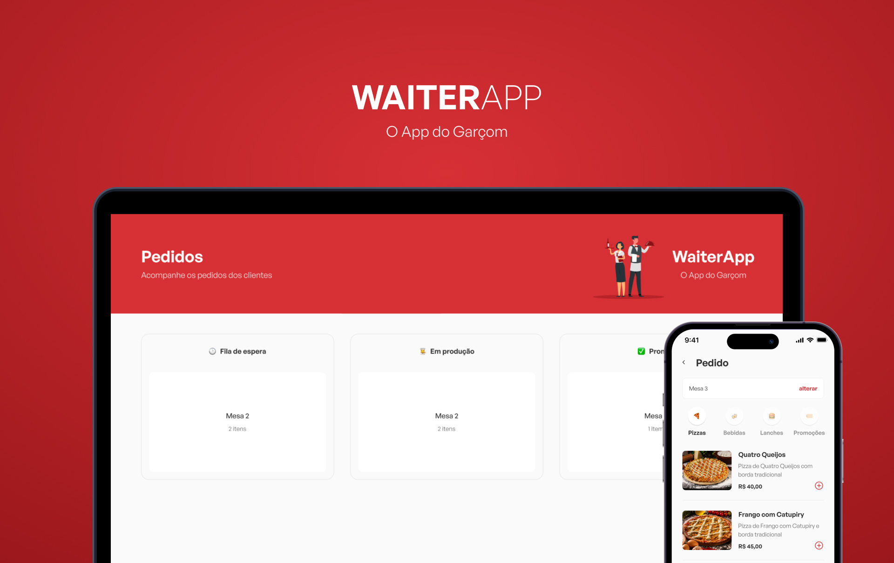

<p align="center">
  
</p>

## 💻 Sobre o projeto

O objetivo por trás é de melhorar o fluxo de pedidos do seu restaurante, conectando os garçons com a cozinha, de modo simples, prático e funcional! <br><br>

A aplicação mobile funciona como um cardápio para os garçons, que estarão anotando o número da mesa e os pedidos dos clientes, enviando as informações adiante para a cozinha. Que, por sua vez, visualizará através da aplicação web, onde há um dashboard para maior controle dos pedidos: passando o pedido adiante (da fila para produção, da produção para preparado) ou cancelando o pedido. Já a nossa API, será a responsável por lidar com todas as informações, manipulações e o envio de dados de ponta a ponta.
<br>

## 👨‍💻 Tecnologias

Backend:
- [Node.JS](https://nodejs.org/en/)
- [Express](https://expressjs.com/pt-br/)
- [Express Async Errors](https://www.npmjs.com/package/express-async-errors)
- [Docker](https://www.docker.com/)
- [DotEnv](https://www.npmjs.com/package/dotenv)
- [Mongoose](https://www.npmjs.com/package/mongoose)
- [Multer](https://www.npmjs.com/package/multer)
- [Socket IO](https://www.npmjs.com/package/socket.io)

<br>

Frontend:
- [React](https://reactjs.org/)
- [React DOM](https://reactjs.org/docs/react-dom.html)
- [React Toastify](https://www.npmjs.com/package/react-toastify)
- [Axios](https://www.npmjs.com/package/axios)
- [Socket IO](https://www.npmjs.com/package/socket.io)
- [Styled Components](https://styled-components.com/)
- [Vite](https://vitejs.dev/)

Mobile:
- [React](https://reactjs.org/)
- [React Native](https://www.npmjs.com/package/react-native)
- [Axios](https://www.npmjs.com/package/axios)
- [Expo](https://www.npmjs.com/package/expo)
- [Styled Components](https://styled-components.com/)

<br>

## 🚀 Execução

**Atenção:** Instale o NodeJS e o Docker localmente em sua máquina antes de continuar com a instação!

<br>

Faça um clone desse repositório e acesse o diretório.
```bash
$ git clone https://github.com/dbssy/waiterapp.git
$ cd waiterapp
```

<br>

Instale os pacotes necessários para rodar o projeto, que estão dentro de suas respectivas pastas (server, web e mobile).
```bash
$ npm install
```

<br>

Rode os comandos abaixos para instalar a imagem do Postgres no Docker.
```bash
# Baixar a imagem
$ docker pull mongo

# Criar o container
$ docker run --name waiterapp 27017:27017 -d mongo

# Caso não tenha iniciado automaticamente, rode:
$ docker start waiterapp

# Para verificar se o container está rodando, rode:
$ docker ps
```

<br>

Com todas as dependências instaladas e o docker rodando, acesse as respectivas pastas (server, web e mobile) e execute o comando abaixo para rodar a aplicação.
```bash
$ npm run dev
```

<br>

*Obs:* Não se esqueça de alterar a **URI** das imagens na aplicação mobile, para que as imagens sejam exibidas corretamente. Você deve procurar por `http://192.168.15.174` e substituir com o seu IP.

<br>

## 📝 Licença

Esse projeto está sob a licença MIT. Veja o arquivo [LICENSE](LICENSE.md) para mais detalhes.